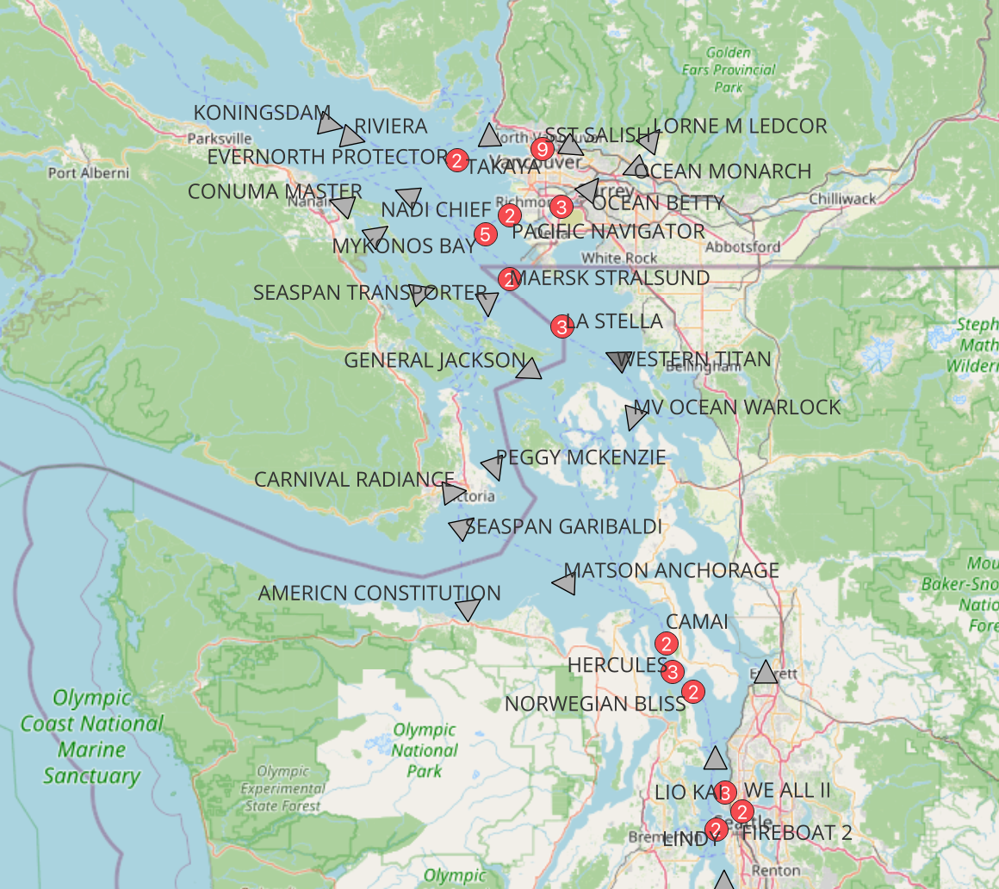
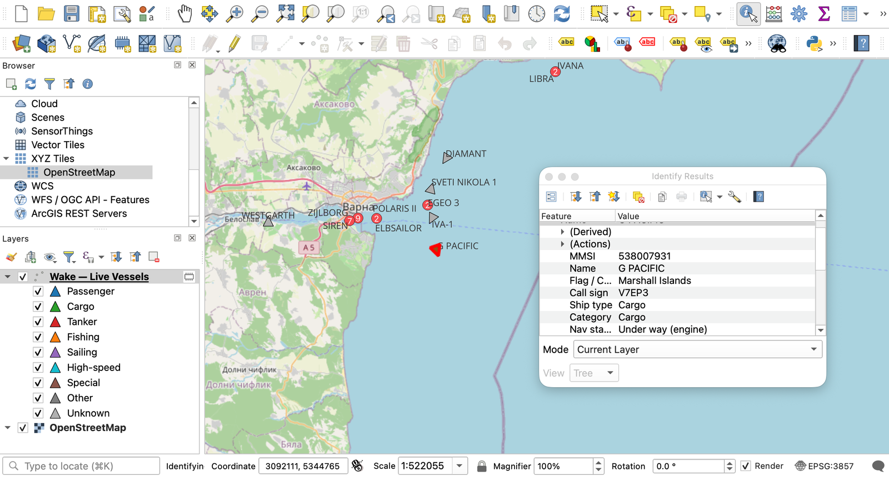
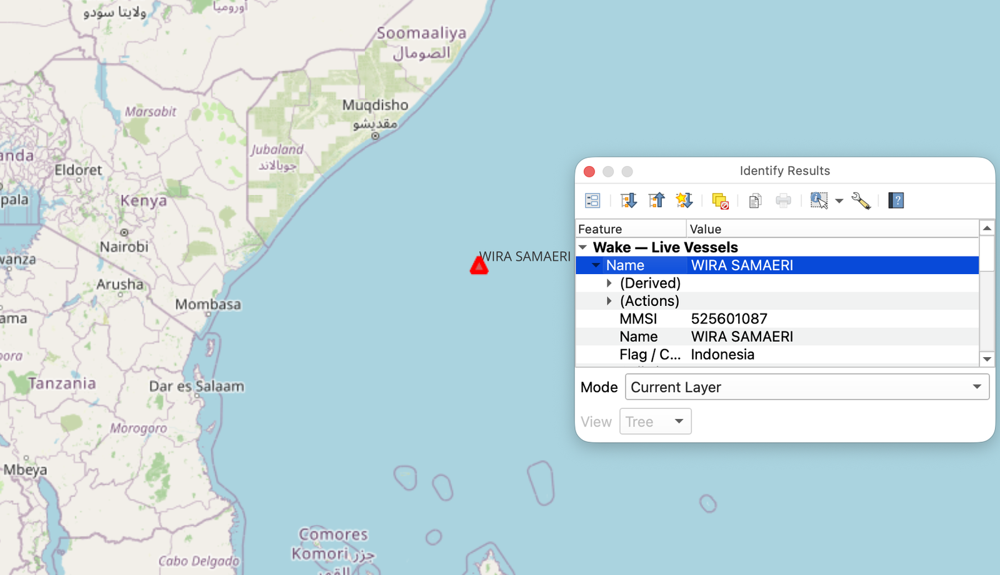

# Wake

Watch **live marine vessel traffic** on your map. Wake streams real-time AIS
ship positions into QGIS and shows vessels moving — track your current map view,
or draw an area to watch. Wake shows *live* traffic only; it does not replay
history.

Wake is one of three sibling plugins built on the same live-tracking engine — a
pluggable data-source layer, a moving-point map layer, clustering and identify —
covering **sea, sky and space**:

- **Wake** — marine vessels (this one)
- [Contrail](https://github.com/PeterCotroneo/Contrail) — aircraft (ADS-B)
- [Zenith](https://github.com/PeterCotroneo/Zenith) — satellites



## Features

- **Area-based, not MMSI-based** — watch *all* traffic in your map view or a drawn box, not just ships you already know.
- **Multiple data sources** — pick a provider in the panel; more can be added without touching the map or UI:
  - **aisstream.io** — global reach, free account and API key (you supply your own).
  - **Open Waters (aiscast)** — open volunteer network, free token (positions only, no ship types).
  - **Digitraffic** — Finland and the Baltic, **no key required**.
- **Class A *and* Class B** — cargo and tankers *and* the smaller fishing/leisure craft that Class-A-only tools miss.
- **Rich vessel detail** — coloured by ship type, rotated by heading, with name, flag/country, speed, destination and dimensions. Click a vessel to Identify it, with one-click links out to MarineTraffic and VesselFinder.
- **Cluster badges** — busy harbours collapse into a single marker with a count; zoom in and they fan out into individual vessels.
- **Show only moving vessels** — one toggle hides moored and anchored craft (by speed over ground), so you see just what is under way.
- **Resilient** — auto-reconnects after a laptop sleep or network drop; no extra dependencies (uses Qt's built-in WebSocket), so it installs cleanly from the QGIS plugin repository.

Pairs naturally with [SeaState US](https://github.com/PeterCotroneo/SeaState-US):
vessel movement and coastal conditions in one map.

## Screenshots

Identify any vessel for its full AIS detail and flag, with links out to MarineTraffic / VesselFinder:



Global reach — a lone tanker tracked far off the Somali coast:



## Install

1. Download this repository as a ZIP (or clone it).
2. In QGIS: **Plugins → Manage and Install Plugins → Install from ZIP**, and select the `wake/` folder zipped, or copy `wake/` into your QGIS plugins directory.
3. Enable **Wake** in the plugin list. A **Wake** panel appears on the right.

## Usage

1. In the **Wake** panel, choose a **Source** and click **Configure…** to enter a key/token if the provider needs one (Digitraffic needs none).
2. Choose **Track the current map view** or **Draw an area on the map**.
3. Click **Start tracking**. Vessels stream in and move in real time. Pan or zoom and the watched area follows.

## Data sources and coverage

Wake is only as good as the feed behind it, and free AIS feeds are **terrestrial
and volunteer-fed** — dense around Europe and North America, sparse or empty
elsewhere (for example, the Persian Gulf and much of Asia). Open-ocean and
low-coverage regions need commercial **satellite** AIS, which Wake does not ship
with. Digitraffic covers Finnish/Baltic waters only. All sources are live; Wake
does not store or replay history.

## Layout

```
wake/
  metadata.txt          QGIS plugin metadata
  __init__.py           classFactory entry point
  wake_plugin.py        dock panel, area selection, start/stop, status, clustering + moving filter
  vessels.py            live vessel layer, batched updates, styling, ship-type memory
  config_dialog.py      schema-driven provider configuration dialog
  mid.py                MMSI -> flag/country lookup
  providers/
    base.py             AisProvider abstraction + normalised vessel contract
    aisstream.py        aisstream.io and Open Waters providers (Qt WebSocket)
    digitraffic.py      Digitraffic provider (keyless REST polling)
    __init__.py         provider registry
```

## Requests

Want a specific AIS provider added? I'm happy to add one. Ping me at
**peter.cotroneo.qgis@gmail.com** with the source and I'll take a look.

## License

GPL-2.0-or-later.
